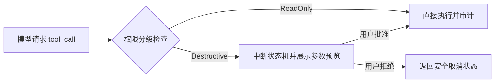

## 1. 核心设计原则

安全控制绝对不能外包给 LLM 的自觉性。对于修改系统配置、外发网络请求、批量覆盖或恢复备份等操作，宿主网关必须在工具执行器层面拦截，向用户展示**具体目标路径、影响行数与变更摘要**，获得确认令牌后才放行。

## 2. 审批状态流

```mermaid
flowchart LR
  LLM["模型请求 tool_call"] --> Policy{"权限分级检查"}
  Policy -- ReadOnly --> Exec["直接执行并审计"]
  Policy -- Destructive --> Pause["中断状态机并展示参数预览"]
  Pause -- 用户批准 --> Exec
  Pause -- 用户拒绝 --> Abort["返回安全取消状态"]
```
